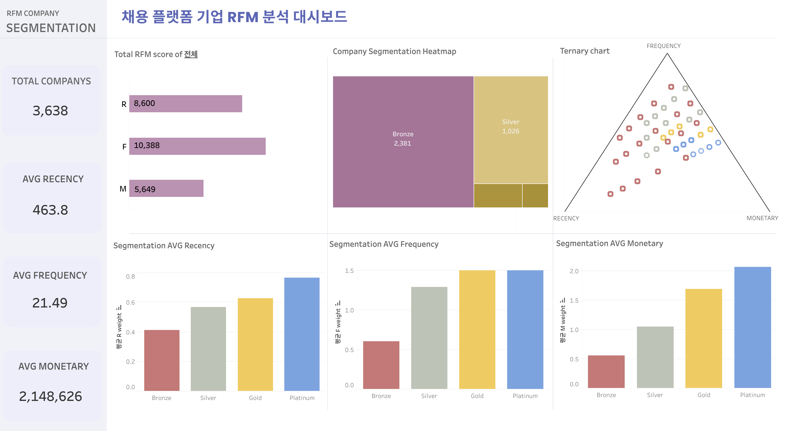

# 📊 채용 플랫폼 이용패턴 분석

> **사용자 로그 분석을 통해 이탈률을 낮추고, 전환율을 높이기 위한 전략 설계 프로젝트**

---

## ✅ 프로젝트 개요

### 🎯 목표

- 채용 플랫폼 내 **사용자 이탈 구간을 퍼널 분석**을 통해 도출
- **행동 기반 가설 설정 및 A/B 테스트 설계**
- **RFM,퍼널 대시보드(Tableau) 설계 및 구현**
- **사용자 세분화를 통한 맞춤 전략 제안**

### 📅 데이터 개요

- **데이터 기간**: 2022.01.01 ~ 2023.12.31 (2년치)
- **분석 수행 기간**: 2025.01.06 ~ 2025.01.31 (4주간)

### 📦 활용 데이터 테이블

| #   | 테이블명  | 설명                 |
| --- | --------- | -------------------- |
| 1   | `company` | 기업 정보 마스터     |
| 4   | `job`     | 채용공고 정보 마스터 |
| 8   | `log`     | 사용자 행동 로그     |

---

### 💼 프로젝트 팀 구성

- **팀 프로젝트** (4인 팀, 기업 데이터 프로젝트)

---

## 👥 팀 구성 및 역할

| 이름   | 역할                                                             | GitHub                                          |
| ------ | ---------------------------------------------------------------- | ----------------------------------------------- |
| 박준혁 | 퍼널 분석, AB 테스트 설계, 로그 데이터 전처리, RFM 대시보드 구현 | [junhyeok0703](https://github.com/junhyeok0703) |
| 고명진 | 기업, 고객 RFM 기준으로 세그먼트화, 세그먼트별 제안              | -                                               |
| 박세종 | 퍼널 분석, 코호트 분석                                           | -                                               |
| 조재윤 | 퍼널 분석, AB 테스트 설계, 퍼널 대시보드 구현                    | -                                               |

---

## 📁 프로젝트 산출물

| 항목                 | 링크                                                                                                     |
| -------------------- | -------------------------------------------------------------------------------------------------------- |
| 📄 분석 보고서       | [`채용 플랫폼 분석 보고서`](./채용플랫폼분석_보고서.pdf)                                                 |
| 📄 발표 자료         | [`채용 플랫폼 발표 자료`](./채용플랫폼발표자료.pdf)                                                      |
| 📄 A/B 테스트 설계서 | [`AB테스트설계_가설1(버튼).pdf`](<./AB테스트설계_가설1(버튼).pdf>)                                       |
| 📄 A/B 테스트 설계서 | [`AB테스트설계_가설2(필터링).pdf`](<./AB테스트설계_가설2(필터링).pdf>)                                   |
| 🔗 Tableau 대시보드  | [대시보드 링크](https://public.tableau.com/app/profile/junhyeok.park8649/viz/RFM_17377038132030/sheet14) |
| 🖼 대시보드 이미지    |                                                                  |

---

## ✅ STAR 기반 프로젝트 설명

### ✅ 상황 (Situation)

- **채용 플랫폼**의 DAU와 채용공고 수가 **지속적으로 감소**하는 현상 발생
- IT 채용 시장의 변화로 대형 플랫폼에 사용자와 기업이 집중되고 있으며, 자사 플랫폼의 **사용자 이탈**과 **전환율 낮음**
- UI/UX 개선을 통해 **경쟁력 확보**와 **전환율 향상**이 필요한 상황

### ✅ 과제 (Task)

**사용자 행동 분석과 A/B 테스트를 통해 이탈률을 줄이고, 전환율을 높이기 위한 전략을 설계하자**

- **퍼널 분석을 통한 이탈 구간 분석**
- **A/B 테스트 설계 및 개선안 도출**
- **UI/UX 개선 전략 제안**

### ✅ 실행 (Action)

#### 🔹 1. 퍼널 정의 및 로그 탐색

**T (Task)**: 퍼널 분석을 통해 **사용자 행동 흐름을 정의**하고, **이탈률이 높은 구간**을 파악하는 작업이 필요했습니다.

**A (Action)**:

- 사용자 로그 데이터를 분석하여 URL path와 query를 **직접 파싱**해 퍼널을 정의했습니다.
- `채용페이지 → 공고페이지 → 지원시작 → 지원완료`로 구체적인 퍼널을 설계했으며, 특히 **공고페이지 → 지원시작** 구간의 이탈률이 **37%**로 매우 높다는 사실을 발견했습니다.
- 이탈률이 높은 지점에서의 문제를 **사용자들이 채용공고를 쇼핑하듯 탐색**하고 다른 공고를 비교하는 과정 때문이라고 분석했습니다.
- 이에 대한 해결책으로 **A/B 테스트 설계를 시작**했습니다.

#### 🔹 2. A/B 테스트 설계

**T (Task)**: A/B 테스트를 통해 **UI/UX 개선**의 효과를 검증하고, **전환율을 높이는 전략**을 설계해야 했습니다.

**A (Action)**:

- **가설 1**: '지원하기' 버튼이 **스크롤 시 사라지는 UI 문제**로 인해 클릭률이 낮다는 가설을 설정했습니다.
- **가설 2**: **SW 개발 직군 필터링이 부족**해 직군 매칭 효율이 낮다는 문제를 해결하기 위한 가설을 도출했습니다.
- 이를 바탕으로 **A/B 테스트**를 설계하여 **버튼 고정**과 **직군 필터 개선**에 따른 실험을 진행했습니다.
- 성공/보조/가드레일 지표를 정의하고, **DAU 기반 샘플 사이즈 계산** 및 **노출 기간**을 설정하여 실험을 설계했습니다.

#### 🔹 3. 사용자 유형 분석 및 시계열 분석

**T (Task)**: **사용자 유형을 분석**하고, **시계열 분석**을 통해 **이탈률과 지원 패턴**의 관계를 파악해야 했습니다.

**A (Action)**:

- **RFM 모델**을 활용하여 사용자를 **장기, 휴면, 신규**로 분류했습니다.
- **이탈률**, **채용공고 수**, **시간대별 지원 패턴**을 분석하여 **주간/월간 패턴**을 도출하고, **공고 수와 지원률** 간의 상관관계를 분석했습니다.

#### 🔹 4. 대시보드 설계 및 구현

**T (Task)**: 대시보드를 설계하여 의사결정자들이 **실시간 데이터를 확인**하고 **빠르게 의사결정**을 내릴 수 있도록 해야 했습니다.

**A (Action)**:

- **피그마**로 대시보드 UI 시안을 설계하고, **Tableau**를 사용하여 대시보드를 구현했습니다.
- **퍼널 대시보드**와 **RFM 대시보드**를 설계하고, **실시간 반응형 필터**를 적용하여 데이터를 시각화했습니다.
- **의사결정자용 대시보드**로 활용할 수 있도록 구성하여, 빠른 의사결정이 가능하도록 만들었습니다.

---

### ✅ 결과 (Result)

| 성과 항목              | 내용                                                  |
| ---------------------- | ----------------------------------------------------- |
| 퍼널 정의 및 이탈 분석 | 이탈률이 높은 핵심 구간(37%) 정의와 원인 분석         |
| A/B 테스트 설계        | ‘지원하기’ 버튼 고정, 직군 필터 개선을 통한 실험 설계 |
| 대시보드 시각화        | 실시간 반응형 대시보드를 통한 의사결정 지원           |

---

## 💡 회고

### ✅ 잘한 점

- **A/B 테스트 설계**에서 UI/UX 개선을 통한 전환율 향상 가능성을 제시
- **RFM 모델**을 사용하여 사용자 행동을 분류하고 분석

### ❗️ 아쉬운 점

- **문제를 더 세분화**하여 문제의 원인 분석을 더 깊이 할 수 있었음
- **실시간 데이터 처리**와 **피드백 루프**를 고려한 구조 설계가 부족했음

### 🔄 개선 방향

- **실시간 피드백 루프**를 구축하여 **UI/UX 개선 효과**를 즉각적으로 반영할 수 있는 시스템 설계
- **사용자 행동 변화 예측 모델** 및 **추천 시스템**을 추가하여 전환율을 더욱 높일 수 있도록 확장

---

## 📊 대시보드

#### 🧑‍💻 Tableau 대시보드

- **링크**: [대시보드 링크](https://public.tableau.com/app/profile/junhyeok.park8649/viz/RFM_17377038132030/sheet14)

#### 📸 대시보드 이미지

> **Tableau**로 구현한 대시보드는 **실시간 데이터 분석**과 **상황에 맞는 빠른 의사결정**을 지원합니다.
